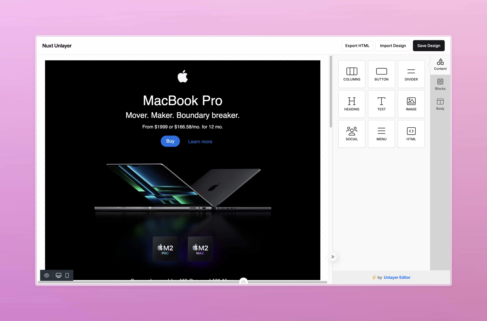

#  Nuxt Unlayer

<!-- automd:badges color="green" license github="baybreezy/nuxt-unlayer" provider="shields" name="nuxt-unlayer" codecov packagephobia -->

[](https://npmjs.com/package/nuxt-unlayer)
[](https://npm.chart.dev/nuxt-unlayer)
[](https://codecov.io/gh/baybreezy/nuxt-unlayer)
[](https://github.com/baybreezy/nuxt-unlayer/blob/main/LICENSE)

<!-- /automd -->

Add the [Unlayer](https://unlayer.com) drag-and-drop email builder to your Nuxt application in minutes.



- [Nuxt Unlayer](#-nuxt-unlayer)
  - [Features](#features)
  - [Demo](#-demo)
  - [Quick Setup](#-quick-setup)
  - [Basic Usage](#-basic-usage)
  - [Loading a Design](#-loading-a-design)
  - [Saving & Exporting](#-saving--exporting)
  - [Props](#-props)
  - [Events](#-events)
  - [TypeScript](#-typescript)
  - [Development](#development)
  - [Contributors](#contributors)

## Features

- **Drop-in component** — `<EmailEditor>` is registered globally and works as a client-only component with zero extra config
- **Full Unlayer API as props** — every option from the Unlayer `Config` interface is available as a Vue prop with full TypeScript types
- **`initialDesign` prop** — preload a saved design at mount time; reactively calls `loadDesign` whenever the value changes
- **Smart reactivity** — props with a live Unlayer setter method (`mergeTags`, `appearance`, `locale`, `linkTypes`, `user`, `tabs`, and more) update the canvas in-place without destroying the editor or losing the user's work
- **Vue events** — `@ready`, `@design:updated`, `@design:loaded`, and `@image:uploaded` are wired up automatically
- **TypeScript** — all Unlayer types are re-exported from `#unlayer/props` so you only need one import

##  Demo

Live demo and full documentation: [nuxt-unlayer.behonbaker.com](https://nuxt-unlayer.behonbaker.com/)

##  Quick Setup

1. Add `nuxt-unlayer` to your project

<!-- automd:pm-install name="nuxt-unlayer" separate -->

```sh
# ✨ Auto-detect
npx nypm install nuxt-unlayer
```

```sh
# npm
npm install nuxt-unlayer
```

```sh
# yarn
yarn add nuxt-unlayer
```

```sh
# pnpm
pnpm install nuxt-unlayer
```

```sh
# bun
bun install nuxt-unlayer
```

```sh
# deno
deno install nuxt-unlayer
```

<!-- /automd -->

2. Add `nuxt-unlayer` to your `nuxt.config.ts`

```ts
export default defineNuxtConfig({
  modules: ["nuxt-unlayer"],
});
```

That's it. The module registers `<EmailEditor>` globally and injects the Unlayer embed script into `<head>` automatically.

> **Note** — `EmailEditor` is a client-only component. It will never execute on the server; you do not need to wrap it in `<ClientOnly>`.

##  Basic Usage

Give the parent element a fixed height — the editor fills 100% of its container.

```vue
<template>
  <div style="height: 100dvh">
    <EmailEditor @ready="onReady" />
  </div>
</template>

<script setup lang="ts">
  import type { EditorInstance } from "#unlayer/props";

  const editor = shallowRef<EditorInstance>();

  const onReady = (instance: EditorInstance | undefined) => {
    editor.value = instance;
  };
</script>
```

##  Loading a Design

Pass a saved `JSONTemplate` to the `initial-design` prop. It loads the design once the editor is ready and reloads whenever the value changes — no manual `loadDesign()` call needed.

```vue
<template>
  <EmailEditor :initial-design="myDesign" @ready="onReady" />
</template>

<script setup lang="ts">
  import type { JSONTemplate, EditorInstance } from "#unlayer/props";

  const myDesign = ref<JSONTemplate>(); // fetch from your API
  const editor = shallowRef<EditorInstance>();

  const onReady = (instance: EditorInstance | undefined) => {
    editor.value = instance;
  };
</script>
```

##  Saving & Exporting

```ts
// Save the design as JSON (to store in your database)
editor.value?.saveDesign((design) => {
  // design is a JSONTemplate — persist it however you like
});

// Export finished HTML (ready to send as an email)
editor.value?.exportHtml((data) => {
  const html = data.html;    // full HTML document
  const json = data.design;  // JSONTemplate
});

// Export as plain text (multi-part emails)
editor.value?.exportPlainText((data) => {
  const text = data.text;
});
```

##  Props

`<EmailEditor>` accepts every option from the [Unlayer Config](https://docs.unlayer.com/builder/configuration) interface. The table below covers the most commonly used props.

| Prop | Type | Default | Description |
|---|---|---|---|
| `display-mode` | `'email' \| 'web' \| 'popup' \| 'document'` | `'email'` | Editor mode |
| `locale` | `string` | `'en-US'` | BCP 47 locale for UI translations |
| `appearance` | `AppearanceConfig` | — | Theme and panel layout options |
| `fonts` | `Fonts` | `{ showDefaultFonts: false }` | Font list shown in the editor |
| `merge-tags` | `MergeTags` | — | Dynamic content placeholders |
| `features` | `Features` | — | Enable/disable editor features (AI, stock images, etc.) |
| `tools` | `ToolsConfig` | — | Enable/disable/reorder content blocks |
| `exclude-tools` | `string[]` | — | Remove specific tools by name |
| `user` | `User` | — | Authenticated user for saved blocks |
| `project-id` | `number` | — | Unlayer project ID |
| `initial-design` | `JSONTemplate` | — | Design to load on mount (reactive) |
| `tabs` | `Tabs` | — | Customise sidebar panel tabs |

**Reactive props** (change these at any time without losing the user's work): `merge-tags`, `appearance`, `locale`, `text-direction`, `translations`, `link-types`, `display-conditions`, `special-links`, `design-tags-config`, `merge-tags-config`, `display-mode`, `tabs`, `user`, `validator`, `initial-design`.

**Re-init props** (editor is destroyed and recreated — save the design first): `tools`, `exclude-tools`, `blocks`, `editor`, `fonts`, `safe-html`, `custom-css`, `custom-js`, `features`, `design-tags`, `project-id`.

##  Events

| Event | Payload | Description |
|---|---|---|
| `@ready` | `EditorInstance \| undefined` | Editor is created and ready |
| `@design:updated` | `{ type, item?, changes? }` | User modified the design |
| `@design:loaded` | `{ design: JSONTemplate }` | A design was loaded into the canvas |
| `@image:uploaded` | `{ image: { url, width?, height? } }` | User uploaded an image |

##  TypeScript

All types are re-exported from `#unlayer/props`:

```ts
import type {
  EditorInstance,        // live editor reference from @ready
  EditorProps,           // full props type (= UnlayerOptions)
  JSONTemplate,          // saved design JSON
  ExportHtmlResult,      // exportHtml callback data
  ExportHtmlOptions,
  ExportPlainTextResult,
  MergeTags,
  Features,
  Fonts,
  AppearanceConfig,
  Tabs,
  User,
  // ...and more
} from "#unlayer/props";
```

## Development

```bash
# Install dependencies
bun install

# Generate type stubs
bun run dev:prepare

# Develop with the docs
bun run dev

# Build the docs
bun run dev:build

# Run ESLint
bun run lint

# Run Vitest
bun run test
bun run test:watch

# Release new version
bun run release
```

## Contributors

Published under the [MIT](https://github.com/baybreezy/nuxt-unlayer/blob/main/LICENSE) license.
Made by [@BayBreezy](https://github.com/BayBreezy) with ❤️

<a href="https://github.com/baybreezy/nuxt-unlayer/graphs/contributors">

</a>

<!-- automd:with-automd lastUpdate -->

---

_🤖 auto updated with [automd](https://automd.unjs.io) (last updated: Mon Oct 21 2024)_

<!-- /automd -->
