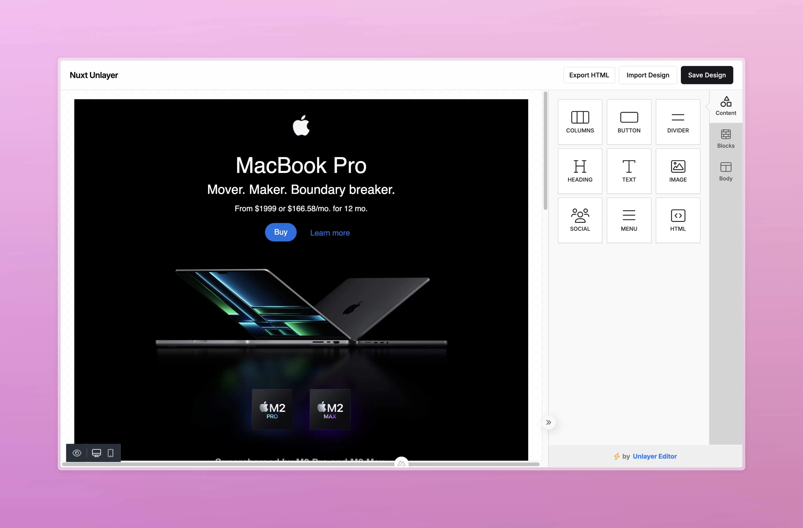

#  Nuxt Unlayer

<!-- automd:badges color="green" license github="baybreezy/nuxt-unlayer" provider="shields" name="nuxt-unlayer" codecov packagephobia -->

[](https://npmjs.com/package/nuxt-unlayer)
[](https://npm.chart.dev/nuxt-unlayer)
[](https://codecov.io/gh/baybreezy/nuxt-unlayer)
[](https://github.com/baybreezy/nuxt-unlayer/blob/main/LICENSE)

<!-- /automd -->



- [ Nuxt Unlayer](#-nuxt-unlayer)
  - [ Demo](#-demo)
  - [ Quick Setup](#-quick-setup)
  - [ Full Example](#-full-example)
  - [ Screenshot](#-screenshot)
  - [Development](#development)
  - [Contributors](#contributors)

##  Demo

The Demo is available at [Nuxt Unlayer Playground](https://nuxt-unlayer.behonbaker.com/)

##  Quick Setup

1. Add `nuxt-unlayer` dependency to your project

<!-- automd:pm-install name="nuxt-unlayer" separate -->

```sh
# ✨ Auto-detect
npx nypm install nuxt-unlayer
```

```sh
# npm
npm install nuxt-unlayer
```

```sh
# yarn
yarn add nuxt-unlayer
```

```sh
# pnpm
pnpm install nuxt-unlayer
```

```sh
# bun
bun install nuxt-unlayer
```

```sh
# deno
deno install nuxt-unlayer
```

<!-- /automd -->

1. Add `nuxt-unlayer` to the `modules` section of `nuxt.config.ts`

```js
export default defineNuxtConfig({
  modules: ["nuxt-unlayer"],
});
```

That's it! You can now use Nuxt Unlayer in your Nuxt app ✨

##  Full Example

<details>
<summary>Full Example</summary>

<!-- automd:file src="./playground/app/app.vue" lang="vue" code -->

```vue [app.vue]
<template>
  <main class="main">
    <UiNavbar sticky>
      <div class="flex h-16 max-w-screen-2xl items-center justify-between px-5">
        <h1 class="text-lg font-semibold tracking-tight">Nuxt Unlayer</h1>
        <div v-if="editor" class="flex items-center gap-2">
          <UiButton variant="outline" size="sm" @click="exportHTML">Export HTML</UiButton>
          <UiButton variant="outline" @click="hiddenFile.click()">Import Design</UiButton>
          <UiButton class="btn" @click="saveDesign">Save Design</UiButton>
        </div>
      </div>
    </UiNavbar>
    <section class="h-[calc(100dvh-65px)]">
      <ClientOnly>
        <EmailEditor
          display-mode="email"
          :appearance="{
            theme: 'dark',
          }"
          @ready="editorLoaded"
        />
      </ClientOnly>
    </section>
  </main>
  <!-- eslint-disable-next-line vue/html-self-closing -->
  <input ref="hiddenFile" type="file" hidden accept=".json" @change="importDesign" />
  <UiVueSonner />
</template>

<script setup lang="ts">
  import sample from "@@/sample.json";
  import type { EditorInstance } from "#unlayer/props";

  useHead({ title: "Nuxt - Unlayer" });
  const colorMode = useColorMode();

  const editor = shallowRef<EditorInstance | null | undefined>();
  const hiddenFile = ref();

  const editorLoaded = (value: any) => {
    console.log("🚀 ~ file: app.vue:23 ~ editorLoaded ~ value", value);
    editor.value = value;

    // load up design after the editor gets loaded
    editor.value?.loadDesign(JSON.parse(JSON.stringify(sample)));
    useSonner.success("Editor Loaded", {
      duration: 2000,
      description: "You can now start designing your email template",
    });
  };

  const saveDesign = () => {
    editor.value?.saveDesign((design: any) => {
      useSonner.success("Design Saved", {
        duration: 2000,
        description:
          "Your design has been saved successfully. CHeck the console for the design object",
      });
      console.log("🚀 ~ file: app.vue:31 ~ editor.value.saveDesign ~ design", design);
    });
  };

  const importDesign = (e: any) => {
    if (!e) return;
    const file = e.target.files[0];
    if (!file.type.includes("json")) return;
    const reader = new FileReader();

    reader.onload = function (readVal) {
      const result = readVal.target?.result;
      if (typeof result === "string") {
        editor.value?.loadDesign(JSON.parse(result));
        useSonner.success("Design Imported", {
          duration: 2000,
          description: "Your design has been imported successfully",
        });
      }
    };
    reader.readAsText(file);
  };
  const exportHTML = () => {
    editor.value?.exportHtml((data: any) => {
      const json = data.design; // design json
      console.log("🚀 ~ file: app.vue:40 ~ editor.value.exportHtml ~ json", json);
      const html = data.html; // final html
      console.log("🚀 ~ file: app.vue:42 ~ editor.value.exportHtml ~ html", html);
      useSonner.success("HTML Exported", {
        duration: 2000,
        description: "Your design has been exported successfully. Check the console for the HTML",
      });
    });
  };

  const title = "Nuxt Unlayer";
  const description = "Easily add unlayer to your Nuxt application";
  const image = "/image.jpg";
  const url = "https://nuxt-unlayer.behonbaker.com";
  useSeoMeta({
    description,
    ogTitle: title,
    ogDescription: description,
    ogImage: image,
    twitterTitle: title,
    ogUrl: url,
    twitterDescription: description,
    twitterImage: image,
    twitterCard: "summary_large_image",
  });

  useHead({
    htmlAttrs: {
      lang: "en",
    },
    link: [
      {
        rel: "icon",
        type: "image/png",
        href: "/UnlayerIcon.png",
      },
    ],
  });
</script>
```

<!-- /automd -->

</details>

##  Screenshot


## Development

```bash
# Install dependencies
npm install

# Generate type stubs
npm run dev:prepare

# Develop with the playground
npm run dev

# Build the playground
npm run dev:build

# Run ESLint
npm run lint

# Run Vitest
npm run test
npm run test:watch

# Release new version
npm run release
```

## Contributors

Published under the [MIT](https://github.com/baybreezy/nuxt-unlayer/blob/main/LICENSE) license.
Made by [@BayBreezy](https://github.com/BayBreezy) with ❤️

<a href="https://github.com/baybreezy/nuxt-unlayer/graphs/contributors">

</a>

<!-- automd:with-automd lastUpdate -->

---

_🤖 auto updated with [automd](https://automd.unjs.io) (last updated: Mon Oct 21 2024)_

<!-- /automd -->
